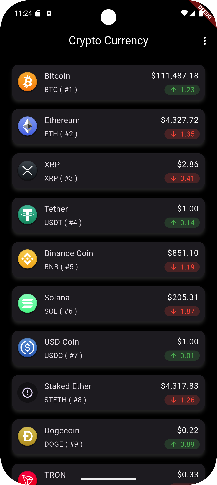
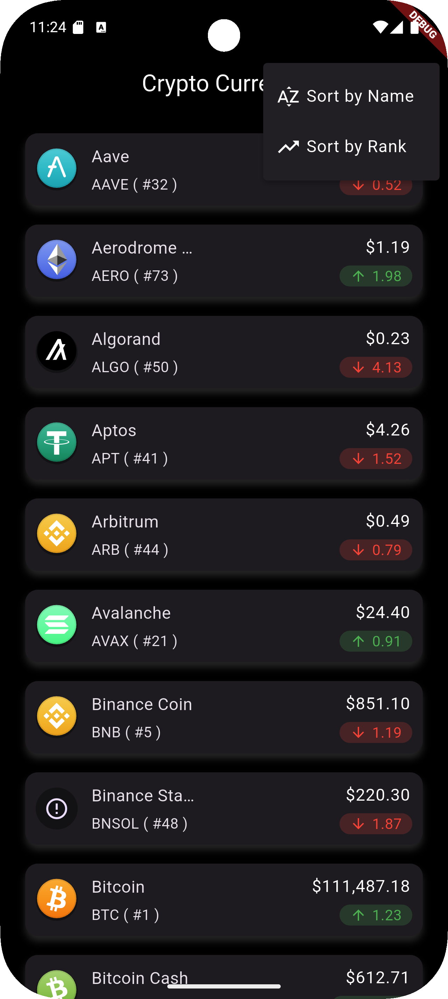

# 🏡 DevProjects - Cryptocurrency price listing mobile app

This is an open source project from [DevProjects](http://www.codementor.io/projects). Feedback and questions are welcome!
🔗 Project requirements: [Cryptocurrency price listing mobile app](https://www.codementor.io/projects/mobile/cryptocurrency-price-listing-mobile-app-atx32meo88)

## 📖 Description
This project is a Flutter app that displays a list of cryptocurrencies with their details using the Coinlore API (Tickers endpoint). The goal is to show the most important data about each cryptocurrency in a simple, clean UI.
---

## 🚀 Features
- **Cryptocurrency List:** Displays a list of cryptocurrencies with key details.
- **Details Shown:** Name, symbol, current price in USD, rank, and 7-day percentage change.
- **Sorting:** Sort cryptocurrencies by alphabet or rank.
- **Long Tap Info:** Long tap on a cryptocurrency to view its full ticker name.
- **Clean UI:** Simple and clean user interface for easy browsing.
- **API Integration:** Fetches real-time data from the Coinlore API.
---

## 📸 Screenshots & Demo
 



---

## 🛠️ Tech Stack
Built with **Flutter** (using the Dart programming language).

**Key Packages**:

- **Dio:** Powerful HTTP client for Dart, used for API requests.
- **Riverpod:** State management solution for managing app state.
- **intl:** For internationalization and formatting numbers/currencies.
- **Coinlore API:** Source of real-time cryptocurrency data.
---

## 📂 Project Structure 

```
lib/
│
├── core/
│   ├── extensions/
│   │   ├── intl_extension.dart
│   │   └── percent_change_extension.dart
│   ├── network/
│   │   ├── api_exceptions.dart
│   │   └── dio_client.dart
│   ├── theme/
│   │   └── app_theme.dart
│   └── utils/
│       └── constants.dart
│
├── features/
│   └── crypto_currency/
│       ├── data/
│       │   ├── api_repository.dart
│       │   ├── api_service.dart
│       │   └── models/
│       │       └── tickers_model.dart
│       ├── presentation/
│       │   └── tickers_page.dart
│       └── providers/
│           ├── ticker_notifier.dart
│           └── tickers_provider.dart
│
├── widgets/
│   ├── percent_change_widget.dart
│   └── ticker_item_widget.dart
```
---

## 🟦 Requirements
* [x] Display a list of cryptocurrencies on the home screen:
  *  [x] Name (e.g., Bitcoin)
  *  [x] Symbol (e.g., BTC)
  *  [x] Current Price in USD (e.g., $6545)
* [x] (Extra challenge) Include these elements to the list item as well:
  *  [x] Rank of the cryptocurrency (e.g. #1)
  *  [x] Percentage change in the last 7 days (e.g. -1.07%)

* [x] Sort data by:
  * [x] Alphabet
  * [x] Rank
---

## ⚙️ Installation & Setup

### Prerequisites
-   **Flutter SDK:** Ensure Flutter is installed on your system. For installation instructions, visit the [official Flutter documentation](https://flutter.dev/docs/get-started/install).
-   **Dart SDK:** This is typically bundled with the Flutter SDK.
-   **IDE:** An Integrated Development Environment like Android Studio (with the Flutter plugin) or Visual Studio Code (with the Flutter extension).
-   **Android Specific (for Notifications on API 33+):**
    Ensure your `android/app/src/main/AndroidManifest.xml` includes:
    ```
    <!--    Internet permission-->
    <uses-permission android:name="android.permission.INTERNET"/>
    ```


### Steps to Run
1.  **Clone the repository (if applicable):**
    If the project is hosted on a version control platform like GitHub, clone it to your local machine:

```
git clone https://github.com/your-username/Crypto-Currency-Price.git
```

2.  **Navigate to the project directory:**
    Change your current directory to the project folder:

```
cd crypto_currency_price
```    

3.  **Run the application:**
    Use the Flutter command to run the application:

```
flutter pub get
flutter run    
```
---

## 📖 Usage 
1. Launch the app
2. The home screen will display a list of cryptocurrencies with their name, symbol, price, rank, and 7-day percentage change.
3. Long tap on a cryptocurrency to view its full ticker name.
4. Use the sort options to organize the list by alphabet or rank.
---

## 🤝Contributing

### Contributions are welcome! 🎉

1. Fork the repository
2. Create a new branch → `(git checkout -b feature-branch)`
3. Commit changes → `git commit -m "Add feature XYZ"`
4. Push changes → `git push origin feature-branch`
5. Open a Pull Request.
